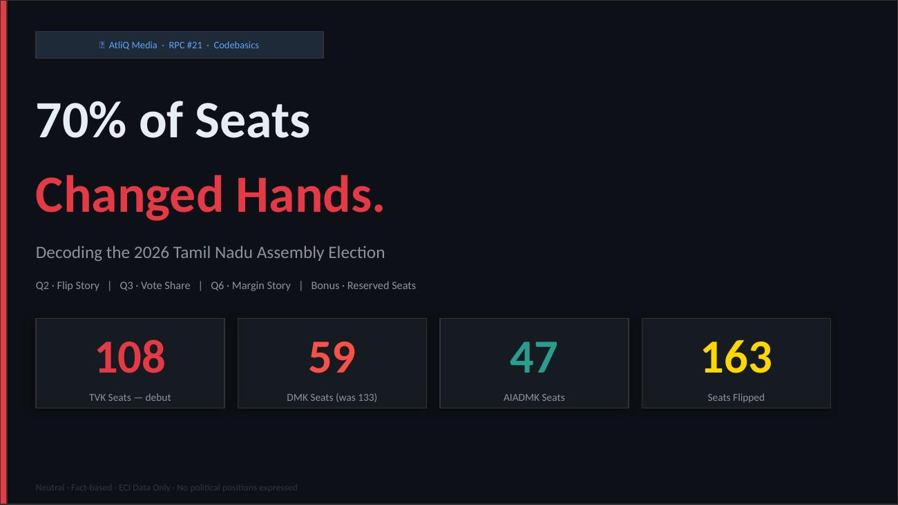
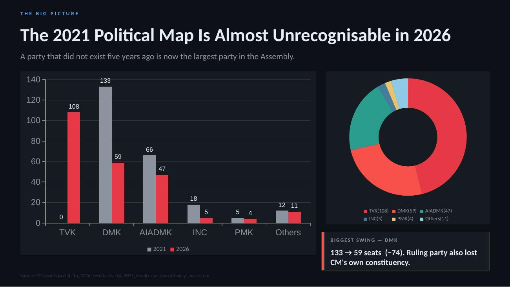
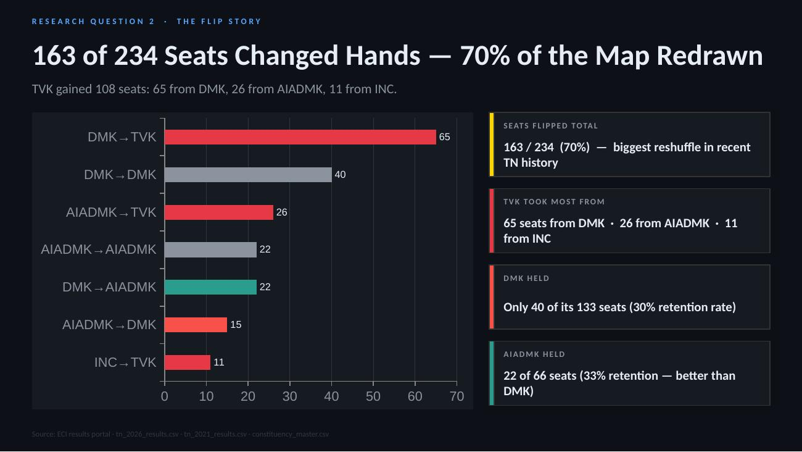
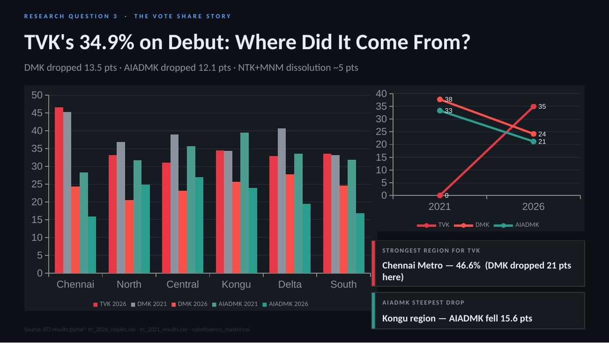
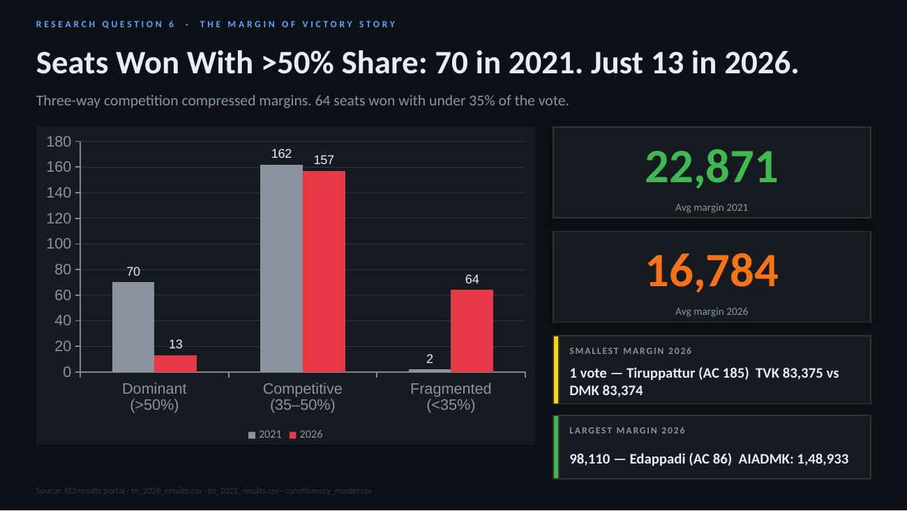
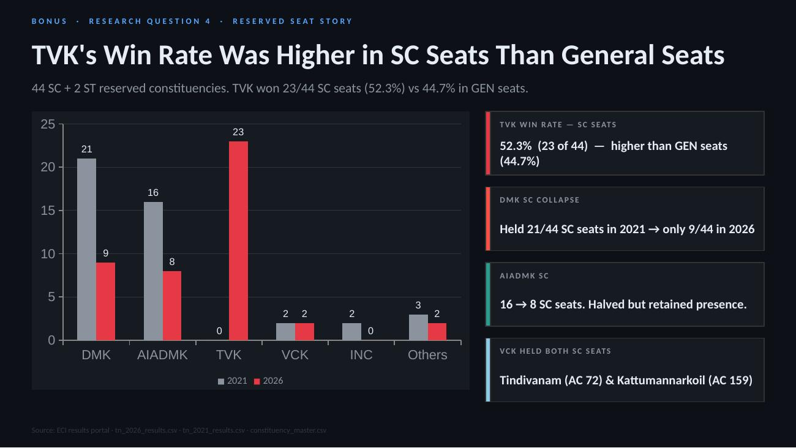
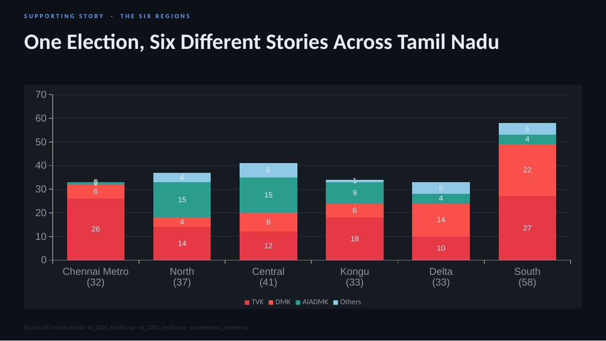
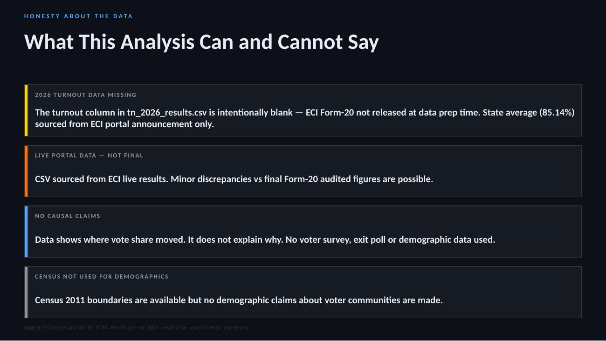
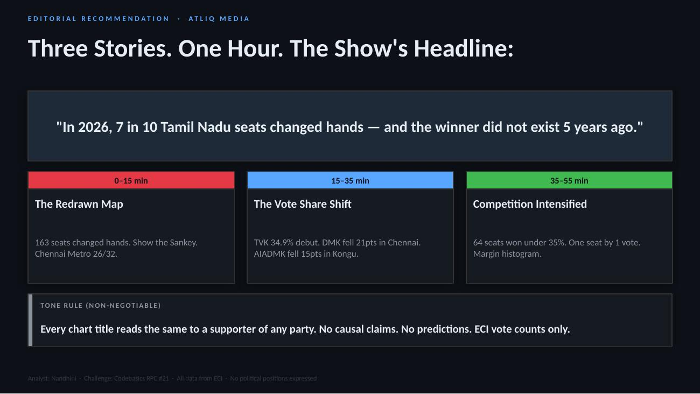

# Decoding the 2026 Tamil Nadu Assembly Election
### Codebasics Resume Project Challenge #21 — AtliQ Media

> **Analyst:** Nandhini &nbsp;|&nbsp; **Challenge:** RPC #21 by Codebasics &nbsp;|&nbsp; **Data:** Election Commission of India
Video Presentation - https://youtu.be/o5gOoeCcRAI?si=XBy9JFhyaVGZA7UU
---

## Problem Statement

**AtliQ Media** is a national news network producing a one-hour TV special on the 2026 Tamil Nadu Assembly election results. Unlike most channels that run heated political debates, AtliQ wants the opposite — a **clean, neutral, fact-based show** using only public ECI data.

As a freelance data analyst, the task was to:
- Find the **most interesting data stories** in the 2026 results
- Build **clear charts** for each story
- Pitch them to AtliQ in a way that helps plan the show

**Rules:** No political commentary. No causal claims. No predictions. ECI data only.

---

## Research Questions Answered

| # | Question | Status |
|---|----------|--------|
| Q2 | **The Flip Story** — How many seats changed hands? What pattern emerges? | ✅ Answered |
| Q3 | **The Vote Share Story** — Where did TVK's votes come from? | ✅ Answered |
| Q6 | **The Margin Story** — How did winning margins change vs 2021? | ✅ Answered |
| Q4 | **Reserved Seat Story** — Did SC/ST seats break differently? | ✅ Bonus |

---

## Key Findings

### 🔄 Q2 — The Flip Story: 163 of 234 Seats Changed Hands

**70% of the political map was redrawn in a single election.**

| Seat Flow | Seats |
|-----------|-------|
| DMK (2021) → TVK (2026) | **65** |
| DMK held | 40 |
| AIADMK (2021) → TVK (2026) | **26** |
| AIADMK held | 22 |
| DMK → AIADMK | 22 |
| INC → TVK | 11 |

- DMK retained only **30%** of its 2021 seats (133 → held 40)
- AIADMK retained **33%** of its 2021 seats (66 → held 22)
- **CM MK Stalin lost his own constituency** — Kolathur (AC 13): TVK 82,997 vs DMK 74,202

---

### 📊 Q3 — The Vote Share Story: TVK's 34.9% — Where Did It Come From?

| Party | 2021 Vote Share | 2026 Vote Share | Change |
|-------|----------------|----------------|--------|
| TVK | 0% | **34.9%** | +34.9 pts |
| DMK | 37.7% | 24.2% | **−13.5 pts** |
| AIADMK | 33.3% | 21.2% | **−12.1 pts** |
| NTK | 6.6% | 4.0% | −2.6 pts |
| MNM (dissolved) | 2.6% | — | −2.6 pts |

**Combined DMK + AIADMK drop = 25.6 pts. NTK + MNM dissolution = ~5 pts.**

Regional vote share (TVK 2026):

| Region | TVK Vote Share | DMK Drop | AIADMK Drop |
|--------|---------------|----------|-------------|
| Chennai Metro | **46.6%** | −21.0 pts | −12.4 pts |
| Kongu | 34.5% | −8.8 pts | **−15.6 pts** |
| South | 33.5% | −8.5 pts | −15.0 pts |
| North | 33.1% | −16.4 pts | −6.8 pts |
| Delta | 32.9% | −13.0 pts | −14.0 pts |
| Central | 31.0% | −15.7 pts | −8.5 pts |

---

### ⚔️ Q6 — The Margin Story: Races Got Much Tighter

| Metric | 2021 | 2026 |
|--------|------|------|
| Average winning margin | 22,871 | **16,784** |
| Median winning margin | 19,131 | 11,416 |
| Seats won with >50% share | **70** | **13** |
| Seats won with <35% share | **2** | **64** |
| Smallest margin | 137 votes | **1 vote** |
| Largest margin | 1,35,571 | 98,110 |

- **Tiruppattur (AC 185):** TVK won by **1 vote** — 83,375 vs DMK 83,374
- **Edappadi (AC 86):** AIADMK won by 98,110 (EPS home seat)
- **Kanniyakumari (AC 229):** 3-way race decided by 214 votes

---

### 🏛️ Bonus Q4 — Reserved Seat Story

| Party | SC Seats 2021 | SC Seats 2026 |
|-------|--------------|--------------|
| TVK | 0 | **23** (52.3%) |
| DMK | 21 | 9 |
| AIADMK | 16 | 8 |
| VCK | 2 | 2 |

TVK's win rate in **SC-reserved seats (52.3%) was higher** than in general seats (44.7%).

---

## Final Seat Count — 2026 vs 2021

| Party | 2021 | 2026 | Change |
|-------|------|------|--------|
| **TVK** | 0 | **108** | +108 🆕 |
| DMK | 133 | **59** | −74 |
| AIADMK | 66 | **47** | −19 |
| INC | 18 | 5 | −13 |
| PMK | 5 | 4 | −1 |
| VCK | 4 | 2 | −2 |
| CPI | 2 | 2 | 0 |
| CPI(M) | 2 | 2 | 0 |
| IUML | 0 | 2 | +2 |
| BJP | 4 | 1 | −3 |
| AMMK | 0 | 1 | +1 |
| DMDK | 0 | 1 | +1 |
| **Total** | **234** | **234** | |

---

## Presentation Slides

### Slide 1 — Title & Headline Findings


### Slide 2 — The Big Picture: 2021 vs 2026


### Slide 3 — Q2: The Flip Story (163 Seats Changed Hands)


### Slide 4 — Q3: The Vote Share Story


### Slide 5 — Q6: The Margin of Victory Story


### Slide 6 — Bonus Q4: Reserved Seat Story


### Slide 7 — Regional Breakdown (6 Regions)


### Slide 8 — Data Limitations & Honesty


### Slide 9 — Editorial Recommendation for AtliQ Media


---

## Repository Structure

```
TN-2026-Election-Analysis/
│
├── README.md                          # This file
├── analysis.py                        # Reproducible Python analysis (run this first)
├── TN_2026_Election_Analysis.pptx     # 9-slide stakeholder deck


├── data/                              # Original ECI source data
│   ├── tn_2026_results.csv            # 4,257 rows — all candidates, 2026
│   ├── tn_2021_results.csv            # 4,232 rows — all candidates, 2021
│   ├── constituency_master.csv        # 234 rows — AC master with district, region
│   └── metadata.txt                   # Column descriptions for all CSVs
│
├── Additional_data/                # Additional data sourced from ECI & Wikipedia
│   ├── district_turnout_2026.csv      # Turnout % for all 38 districts
│   └── alliance_seats_2026.csv        # SPA vs AIADMK+ vs TVK seat totals                      
│   ├── PBI_Winners_2026.csv           # 234 rows — winner per AC with all derived cols
│   ├── PBI_Winners_2021.csv           # 234 rows — winner per AC 2021
│   ├── PBI_VoteShare_Region.csv       # Vote share % by party × region × year
│   ├── PBI_Sankey_Flows.csv           # Seat flows: from_party_2021 → to_party_2026
│   └── PBI_Party_Timeline.csv        # Seats per party 2011–2026
│
└── slides/                            # Slide preview images
    ├── slide-1.jpg … slide-9.jpg
```

---

## How to Run the Analysis

```bash
# Install dependency
pip install pandas

# Run full analysis — generates all output tables & verifies numbers
python analysis.py
```

The script produces all `pbi_data/` CSVs and prints verified key metrics:
- TVK: 108, DMK: 59, AIADMK: 47
- Flipped: 163/234 (70%)
- Avg margin: 16,784 — Min: 1 (Tiruppattur)

---

## Data Sources

| Source | Used For |
|--------|----------|
| [ECI Results Portal](https://results.eci.gov.in/ResultAcGenMay2026) | 2026 candidate-level results |
| Trivedi Centre for Political Data (Ashoka University) | 2021 candidate-level results |
| [Wikipedia — 2026 TN election](https://en.wikipedia.org/wiki/2026_Tamil_Nadu_Legislative_Assembly_election) | District turnout, alliance data |
| ECI Statistical Reports | Historical seat counts 2011, 2016 |

> **Note on 2026 turnout:** The `turnout` column in `tn_2026_results.csv` is intentionally blank — ECI Form-20 (final audited data) was not released at the time of data preparation. District-level turnout (state avg 85.14%) is sourced from the ECI portal announcement.

---

## Neutrality Statement

> This is a **non-partisan data analysis exercise** using only publicly available Election Commission of India data. No political positions are expressed. No party, leader, community, or outcome is praised or criticised. Every chart title reads identically to a supporter of any party. Codebasics does not endorse any political position discussed in this challenge.

---

## Submission Details

- **Challenge:** Codebasics Resume Project Challenge #21
- **Client:** AtliQ Media (fictional)
- **Analyst:** Nandhini (nandhini.s0622@gmail.com)
- **Hashtags:** #ResumeProjectChallenge #Codebasics #DataAnalytics #TamilNaduElection2026
